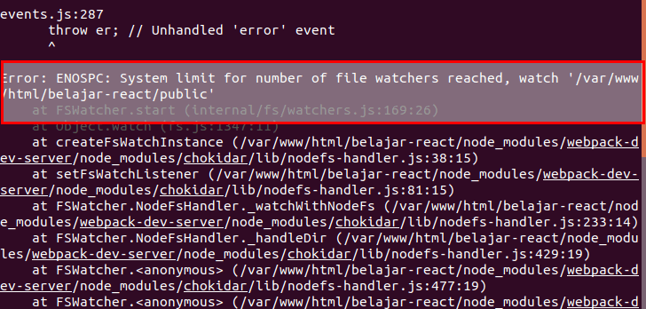

This is multi-sig wallet


Had to Increase System limit for number of file watchers reached.

when i first ran npm start to get the basic react app working I received the error:


Error was fixed by changing:

```
sudo vim /etc/sysctl.conf
fs.inotify.max_user_watches=524288
sudo sysctl -p
```

